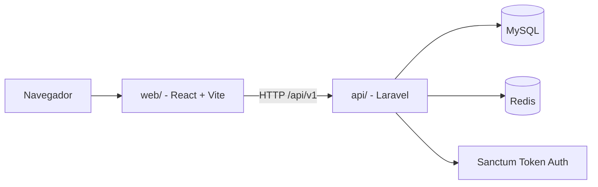

# Arquitetura do Projeto

Este documento descreve a arquitetura completa do sistema e como as partes se conectam.

## 1. Visão geral

O projeto é um monorepo com duas aplicações principais:

- `api/`: backend Laravel 13.
- `web/`: frontend React 19 + TypeScript + Vite.

O objetivo é entregar um sistema web-first de controle financeiro, preparado para uso futuro por outros clientes, como app mobile.

## 2. Diagrama de alto nível

## 3. Frontend

### 3.1 Entrada da aplicação

O frontend começa em [web/src/main.tsx](../web/src/main.tsx), que:

- carrega o CSS global;
- importa Font Awesome;
- monta o componente principal da aplicação.

O roteamento principal está em [web/src/Router.tsx](../web/src/Router.tsx).

### 3.2 Rotas

Existem duas classes de rotas:

- públicas: login e cadastro;
- protegidas: início, categorias, extrato, perfil e assinatura.

As rotas protegidas usam `PrivateRoute` e o layout autenticado para garantir que o usuário só entre depois de autenticado.

### 3.3 Layout

O layout principal fica em [web/src/components/Layout.tsx](../web/src/components/Layout.tsx).

Responsabilidades:

- exibir navegação lateral no desktop;
- exibir barra fixa inferior no mobile;
- mostrar o nome do usuário;
- permitir logout.

### 3.4 Dados e estado

O frontend usa React Query para estado de servidor.

Arquivos-chave:

- [web/src/services/api.ts](../web/src/services/api.ts): client HTTP com Axios;
- [web/src/hooks/api.ts](../web/src/hooks/api.ts): hooks de leitura e escrita;
- [web/src/types/api.ts](../web/src/types/api.ts): tipos compartilhados do contrato.

Fluxo típico:

1. a tela chama um hook;
2. o hook chama uma função do client;
3. o client faz a requisição para o backend;
4. a resposta volta tipada;
5. a query é cacheada;
6. mutações invalidam o cache relacionado.

### 3.5 Internacionalização

As traduções ficam em [web/src/i18n/config.ts](../web/src/i18n/config.ts).

Características:

- suporte a `pt-BR` e `en`;
- idioma salvo em `localStorage` com a chave `app_locale`;
- textos de navegação, formulários, assinatura, perfil, categorias e extrato centralizados em um só lugar.

### 3.6 Estilo visual

Os estilos ficam distribuídos entre:

- `web/src/index.css`
- `web/src/App.css`
- `web/src/styles/layout.css`
- `web/src/styles/pages.css`

Font Awesome é carregado globalmente para manter os ícones consistentes em todo o app.

## 4. Backend

### 4.1 Entrada da API

As rotas da API ficam em [api/routes/api.php](../api/routes/api.php).

O prefixo principal é `/api/v1`.

### 4.2 Segurança e autenticação

O backend usa Laravel Sanctum com token Bearer.

Fluxo resumido:

- o usuário faz login ou cadastro;
- a API devolve um token;
- o frontend grava o token;
- o Axios envia o token no cabeçalho `Authorization`;
- as rotas protegidas exigem `auth:sanctum`.

### 4.3 Domínios principais

Os módulos de negócio atuais são:

- autenticação e perfil;
- categorias;
- transações;
- dashboard;
- assinatura e planos;
- budgets;
- resumo mensal.

### 4.4 Contrato de resposta

As respostas seguem um formato padronizado:

- sucesso: `{ data: ... }`
- erro: `{ error: { type, message, details? } }`

Isso simplifica o tratamento de erros no frontend.

## 5. Fluxo de dados ponta a ponta

Exemplo: criar uma transação.

1. O usuário abre a tela de extrato.
2. A página carrega categorias e transações via hooks.
3. O formulário monta o payload com categoria, tipo, valor, data e observações.
4. O hook de mutation chama `api.createTransaction()`.
5. O backend valida os dados, salva no banco e devolve o novo registro.
6. O frontend invalida `transactions` e `dashboard`.
7. A tela reflete o novo estado sem recarregar a página inteira.

## 6. Persistência

O backend grava os dados no banco principal MySQL.

Entidades centrais:

- `users`
- `categories`
- `transactions`
- `budgets`

Redis é usado como apoio para cache e filas, conforme a configuração do Laravel.

## 7. Organização do repositório

### Backend

- `api/app/`: controllers, models, requests, services e providers.
- `api/routes/`: rotas web, console e API.
- `api/database/`: migrations, factories e seeders.
- `api/tests/`: testes de feature e unitários.

### Frontend

- `web/src/pages/`: páginas da aplicação.
- `web/src/components/`: componentes reutilizáveis.
- `web/src/hooks/`: hooks de dados e autenticação.
- `web/src/services/`: integração com API.
- `web/src/types/`: tipos do contrato.
- `web/src/i18n/`: traduções.
- `web/src/styles/`: estilos específicos.
- `web/src/constants/`: constantes de domínio, como o catálogo de ícones.

## 8. Dependências de infraestrutura

O ambiente local usa Docker Compose e inclui:

- `web`: Vite dev server na porta `5173`;
- `nginx`: expositor da API na porta `8000`;
- `api`: PHP-FPM;
- `db`: MySQL na porta `3306`;
- `redis`: Redis na porta `6379`.

O navegador conversa com o frontend em `5173`, e o frontend conversa com a API em `8000`.

## 9. Padrões arquiteturais atuais

### Frontend

- componente de página por responsabilidade;
- estado remoto controlado por React Query;
- tipagem explícita no contrato com a API;
- traduções centralizadas;
- layout responsivo com comportamento separado para desktop e mobile.

### Backend

- rotas versionadas;
- controllers finos;
- validação em Form Requests;
- autenticação via Sanctum;
- respostas padronizadas.

## 10. Extensão segura do sistema

Quando for adicionar algo novo, tente preservar estas regras:

- não quebre o contrato `/api/v1` sem necessidade;
- mantenha as respostas no formato `data/error`;
- não coloque regra de negócio no componente React;
- atualize tipos, traduções e testes junto com a feature;
- invalide o cache correto depois de uma mutation.

## 11. Pontos de atenção

- O frontend depende de `VITE_API_URL` para falar com o backend.
- O idioma pode ser alterado pelo usuário e precisa continuar sincronizado com `localStorage`.
- Mudanças de layout no mobile devem ser testadas diretamente em viewport estreita.
- Se o backend mudar o shape da resposta, o TypeScript do frontend pode quebrar de forma útil; isso é sinal de que o contrato mudou.

## 12. Resumo prático

Se você quiser entender o sistema em uma frase:

> React mostra a interface, React Query controla os dados remotos, Axios conversa com uma API Laravel versionada, e o backend valida, autentica e persiste tudo no MySQL.